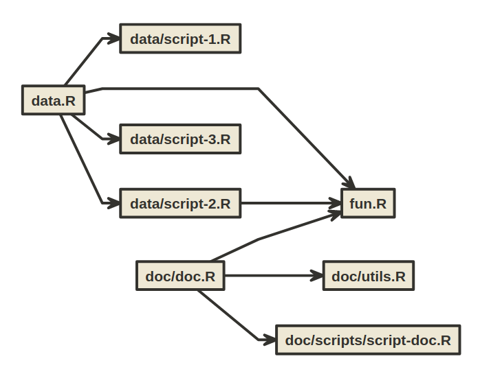

<!-- README.md is generated from README.Rmd. Please edit that file -->

## Explore `source` & `sourceDirectory` with [flow](https://github.com/moodymudskipper/flow)

``` r
library(flow)
scripts <- list.files(".", pattern = "\\.R$", full.names = FALSE, recursive = TRUE)
flow_view_source_calls(scripts, basename = FALSE, extension = TRUE)
```


